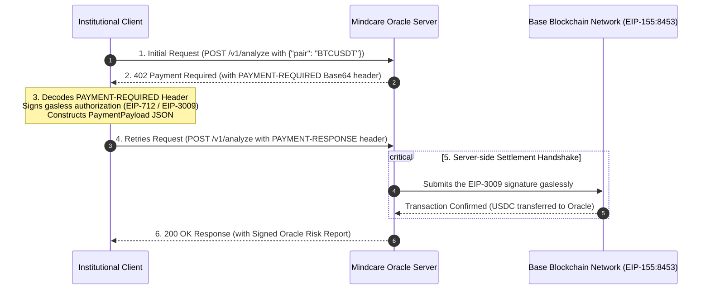

# 🌟 Mindcare Oracle: Institutional Developer Integration Guide

This integration guide explains how to paywall-gate and settle micropayments using the **x402 Protocol** to interact with the **Mindcare Risk & Liquidity Oracle** endpoint (`POST /v1/analyze`). 

The Mindcare Oracle leverages CAIP-2 network standards and gasless transaction mechanics (EIP-3009 / Permit2) to enable trustless, machine-to-machine micropayments.

---

## 🏗️ The 402 Paywall Settlement Flow

The x402 protocol relies on a smart **2-step HTTP handshake** to negotiate and settle gasless on-chain payments. Below is the step-by-step sequence:



### Flow Breakdown
1. **Initial Handshake**: The Client sends a standard JSON payload to `/v1/analyze`.
2. **Challenge Issued**: The Server intercepts the request, generates a unique challenge, and returns an **HTTP 402 Payment Required** status. The challenge metadata is packed inside the `PAYMENT-REQUIRED` response header (Base64-encoded JSON).
3. **Local Signing**: The Client decodes the header, extracts the required payment details (recipient, amount, asset contract, and network), and signs an **EIP-712** message authorizing the transfer of USDC on the Base network (`eip155:8453`).
4. **Resubmission**: The Client retries the exact same request, passing the Base64-encoded `PaymentPayload` inside the `PAYMENT-RESPONSE` HTTP header.
5. **On-chain Settlement**: The Server verifies the signature, submits it to the Base network to execute the gasless USDC transfer, and processes the original request.
6. **Data Delivery**: The Server returns an **HTTP 200 OK** with the signed liquidity risk audit report.

---

## 🐍 Python Integration Example

Below are two methods to integrate in Python: **Method A** handles the handshake manually using `requests` and `eth_account` to demonstrate the underlying cryptography, and **Method B** uses the official `x402` SDK for production convenience.

### Method A: Manual HTTP Handshake (`requests` & `eth_account`)

```python
import base64
import json
import secrets
import time
import requests
from eth_account import Account
from eth_account.messages import encode_typed_data

# 1. Initialize Payer Wallet (Must have USDC & ETH gas/allowance on Base Network)
BUYER_PRIVATE_KEY = "0xYOUR_PRIVATE_KEY_HERE"
buyer_account = Account.from_key(BUYER_PRIVATE_KEY)
payer_address = buyer_account.address

print(f"Payer Address: {payer_address}")

# Target Endpoint
ENDPOINT_URL = "http://localhost:8000/v1/analyze"
PAYLOAD_DATA = {"pair": "BTCUSDT"}

# -------------------------------------------------------------
# Step 1: Send Initial Request to get 402 Challenge
# -------------------------------------------------------------
print("\n[Step 1] Sending initial request...")
res = requests.post(ENDPOINT_URL, json=PAYLOAD_DATA)

if res.status_code != 402:
    print(f"Unexpected response code: {res.status_code}")
    exit(1)

# Retrieve the Base64-encoded payment requirements challenge
payment_required_b64 = res.headers.get("PAYMENT-REQUIRED")
if not payment_required_b64:
    print("Error: PAYMENT-REQUIRED header missing!")
    exit(1)

# Decode the challenge
challenge_data = json.loads(base64.b64decode(payment_required_b64).decode("utf-8"))
requirements = challenge_data["accepts"][0]
print(f"Parsed Micropayment Requirement:")
print(f"  - Amount: {requirements['amount']} units (smallest token unit)")
print(f"  - Asset Contract: {requirements['asset']}")
print(f"  - Recipient: {requirements['pay_to']}")
print(f"  - Network: {requirements['network']}")

# -------------------------------------------------------------
# Step 2: Sign the EIP-3009 Typed Data
# -------------------------------------------------------------
print("\n[Step 2] Constructing and signing EIP-3009 authorization...")

# Generate a cryptographically secure 32-byte nonce
nonce = "0x" + secrets.token_hex(32)
valid_after = 0
valid_before = int(time.time()) + requirements["max_timeout_seconds"]

# Define EIP-712 domain (Base network / USDC EIP-3009 implementation)
domain_data = {
    "name": "USD Coin",
    "version": "2",
    "chainId": 8453,  # Base Network CAIP-2 corresponding chainId
    "verifyingContract": requirements["asset"]
}

# Define standard EIP-3009 ReceiveWithAuthorization types
types_data = {
    "EIP712Domain": [
        {"name": "name", "type": "string"},
        {"name": "version", "type": "string"},
        {"name": "chainId", "type": "uint256"},
        {"name": "verifyingContract", "type": "address"}
    ],
    "ReceiveWithAuthorization": [
        {"name": "from", "type": "address"},
        {"name": "to", "type": "address"},
        {"name": "value", "type": "uint256"},
        {"name": "validAfter", "type": "uint256"},
        {"name": "validBefore", "type": "uint256"},
        {"name": "nonce", "type": "bytes32"}
    ]
}

# Message fields matching ReceiveWithAuthorization spec
message_data = {
    "from": payer_address,
    "to": requirements["pay_to"],
    "value": int(requirements["amount"]),
    "validAfter": valid_after,
    "validBefore": valid_before,
    "nonce": bytes.fromhex(nonce[2:])
}

# Sign typed structured data (EIP-712)
signable_message = encode_typed_data(
    domain_data=domain_data,
    types=types_data,
    message_data=message_data
)
signed_message = buyer_account.sign_message(signable_message)
signature = "0x" + signed_message.signature.hex()

# -------------------------------------------------------------
# Step 3: Construct PAYMENT-RESPONSE Payload & POST Back
# -------------------------------------------------------------
print("\n[Step 3] Constructing PaymentPayload and resubmitting request...")

payment_payload = {
    "x402Version": 2,
    "accepted": requirements,
    "payload": {
        "authorization": {
            "fromAddress": payer_address,
            "to": requirements["pay_to"],
            "value": requirements["amount"],
            "validAfter": str(valid_after),
            "validBefore": str(valid_before),
            "nonce": nonce
        },
        "signature": signature
    }
}

# Base64-encode the payload JSON for the PAYMENT-RESPONSE header
payment_response_b64 = base64.b64encode(
    json.dumps(payment_payload).encode("utf-8")
).decode("utf-8")

headers = {
    "PAYMENT-RESPONSE": payment_response_b64,
    "Content-Type": "application/json"
}

retry_res = requests.post(ENDPOINT_URL, json=PAYLOAD_DATA, headers=headers)

if retry_res.status_code == 200:
    print("🎉 SUCCESS! Micropayment settled and report delivered:")
    print(json.dumps(retry_res.json(), indent=2))
else:
    print(f"Payment failed with status {retry_res.status_code}: {retry_res.text}")
```

### Method B: Using the official `x402` SDK (Recommended)

Install the library:
```bash
pip install x402
```

```python
import json
from eth_account import Account
from x402 import x402ClientSync
from x402.http.clients import x402_requests
from x402.mechanisms.evm import EthAccountSigner
from x402.mechanisms.evm.exact.register import register_exact_evm_client

# 1. Initialize Wallet & SDK Signer
buyer_account = Account.from_key("0xYOUR_PRIVATE_KEY_HERE")
signer = EthAccountSigner(buyer_account)

# 2. Configure standard x402 client
client = x402ClientSync()
register_exact_evm_client(client, signer)

# 3. Intercept & execute requests automatically
session = x402_requests(client)
response = session.post(
    "http://localhost:8000/v1/analyze",
    json={"pair": "BTCUSDT"},
    timeout=15.0
)

print(json.dumps(response.json(), indent=2))
```

---

## 🟢 TypeScript / Node.js Integration Example

Below is the complete manual client implementation using **TypeScript**, **Node.js**, and **`ethers.js` (v6)** to settle payments directly.

### Prerequisites

Initialize package and dependencies:
```bash
npm install ethers dotenv
```

### `client.ts`

```typescript
import { ethers } from "ethers";
import Buffer from "buffer";

// 1. Setup Wallet & Network Details
const PRIVATE_KEY = "0xYOUR_PRIVATE_KEY_HERE";
const provider = new ethers.JsonRpcProvider("https://mainnet.base.org");
const wallet = new ethers.Wallet(PRIVATE_KEY, provider);

const ENDPOINT_URL = "http://localhost:8000/v1/analyze";
const PAYLOAD_DATA = { pair: "BTCUSDT" };

async function runHandshake() {
  console.log(`Payer Address: ${wallet.address}`);

  // -------------------------------------------------------------
  // Step 1: Request Endpoint & Fetch 402 Payment Challenge
  // -------------------------------------------------------------
  console.log("\n[Step 1] Sending initial request to get 402 challenge...");
  const initialRes = await fetch(ENDPOINT_URL, {
    method: "POST",
    headers: { "Content-Type": "application/json" },
    body: JSON.stringify(PAYLOAD_DATA),
  });

  if (initialRes.status !== 402) {
    console.error(`Expected 402 Payment Required, got ${initialRes.status}`);
    return;
  }

  const paymentRequiredB64 = initialRes.headers.get("PAYMENT-REQUIRED");
  if (!paymentRequiredB64) {
    console.error("PAYMENT-REQUIRED header missing!");
    return;
  }

  // Decode challenge metadata
  const decodedChallenge = JSON.parse(
    Buffer.Buffer.from(paymentRequiredB64, "base64").toString("utf-8")
  );
  const requirements = decodedChallenge.accepts[0];

  console.log(`Parsed Micropayment Requirements:`);
  console.log(`  - Recipient: ${requirements.pay_to}`);
  console.log(`  - Amount: ${requirements.amount} units`);
  console.log(`  - Asset Contract: ${requirements.asset}`);

  // -------------------------------------------------------------
  // Step 2: Sign EIP-3009 Structure with Ethers EIP-712 API
  // -------------------------------------------------------------
  console.log("\n[Step 2] Signing structured EIP-3009 metadata...");

  const nonce = ethers.hexlify(ethers.randomBytes(32));
  const validAfter = 0;
  const validBefore = Math.floor(Date.now() / 1000) + requirements.max_timeout_seconds;

  // EIP-712 Structured Domain
  const domain = {
    name: "USD Coin",
    version: "2",
    chainId: 8453, // Base Network Chain ID
    verifyingContract: requirements.asset,
  };

  // Structured Types
  const types = {
    ReceiveWithAuthorization: [
      { name: "from", type: "address" },
      { name: "to", type: "address" },
      { name: "value", type: "uint256" },
      { name: "validAfter", type: "uint256" },
      { name: "validBefore", type: "uint256" },
      { name: "nonce", type: "bytes32" },
    ],
  };

  // Message body
  const message = {
    from: wallet.address,
    to: requirements.pay_to,
    value: BigInt(requirements.amount),
    validAfter: validAfter,
    validBefore: validBefore,
    nonce: nonce,
  };

  // Sign Structured Data via wallet signTypedData API
  const signature = await wallet.signTypedData(domain, types, message);

  // -------------------------------------------------------------
  // Step 3: Package PAYMENT-RESPONSE Header & Submit retry
  // -------------------------------------------------------------
  console.log("\n[Step 3] Submitting signed payment payload...");

  const paymentPayload = {
    x402Version: 2,
    accepted: requirements,
    payload: {
      authorization: {
        fromAddress: wallet.address,
        to: requirements.pay_to,
        value: requirements.amount,
        validAfter: String(validAfter),
        validBefore: String(validBefore),
        nonce: nonce,
      },
      signature: signature,
    },
  };

  // Encode structured payload as Base64 JSON
  const paymentResponseB64 = Buffer.Buffer.from(
    JSON.stringify(paymentPayload)
  ).toString("base64");

  const retryRes = await fetch(ENDPOINT_URL, {
    method: "POST",
    headers: {
      "Content-Type": "application/json",
      "PAYMENT-RESPONSE": paymentResponseB64,
    },
    body: JSON.stringify(PAYLOAD_DATA),
  });

  if (retryRes.status === 200) {
    const data = await retryRes.json();
    console.log("🎉 SUCCESS! Audited Report Delivered:\n");
    console.log(JSON.stringify(data, null, 2));
  } else {
    const errText = await retryRes.text();
    console.error(`Verification Failed (${retryRes.status}):`, errText);
  }
}

runHandshake().catch(console.error);
```

---

## 🛡️ Error Handling and Recovery

When executing high-throughput algorithmic API integrations, handle these standard HTTP status codes returned by the resource gateway:

| Code | Cause | Recommended Action |
|---|---|---|
| **402** | Initial request or invalid signature | If initial request, fetch challenge header, sign, and resubmit. If retried and failed, verify that the payer has sufficient USDC and native ETH balances on Base network, and check if EIP-3009 nonce has been reused. |
| **400** | Malformed request body | Check JSON formatting and confirm `pair` is correctly passed (e.g. `{"pair": "BTCUSDT"}`). |
| **429** | API Rate Limiting | Reduce request frequency, implement exponential backoff retry. |
